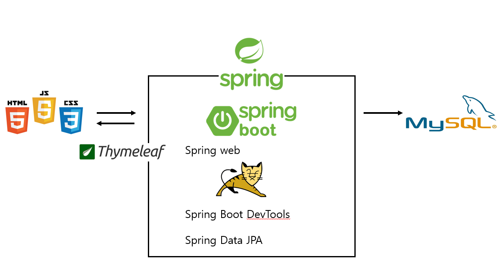

# Spring_Web_Starter
My First Spring Web Project

2021.07 - 2021.08

___
- ### 목차
  - [**프로젝트 개요**](#outline)
  - [**요구사항**](#requirements)
  - [**프로젝트 구조**](#structure)
  - [**화면**](#screen) 

___
- ### 프로젝트 개요 
  - Spring Framework를 이용하여 제작할 첫번째 개인 웹 프로젝트
  - 의존성
    - Spring Boot DevTools
    - SpringWeb
    - Thymeleaf 템플릿 엔진
    - Spring Data JPA 
___
- ### 요구사항
  - Client
    - 회원 정보
      - 회원가입 / 로그인 / 회원 정보 수정 / 회원 탈퇴
    - 게시글
      - 게시글 작성 / 수정 / 삭제 / pagination
___
- ### 프로젝트 구조 

___
- ### 화면 
  - 메인 화면

  - 게시글 작성

